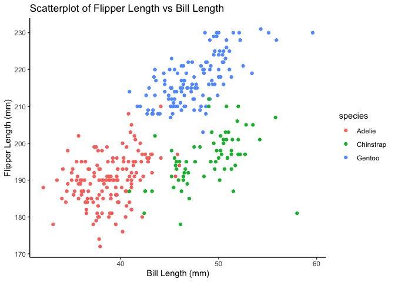

Simple document
================

# Problem 1

## Part 1

``` r
data("penguins", package = "palmerpenguins")
```

**Description**:

- 1.  Important variables

  - The species of penguins includes: Adelie, Gentoo, Chinstrap
  - The islands of oringin includes: Torgersen, Biscoe, Dream
  - The range of their bill length in mm are \[32.1, 59.6\]
  - The range of their bill depth in mm are \[13.1, 21.5\]
  - The range of their flipper length in mm are \[172, 231\]
  - The range of their body mass in g are \[2700, 6300\]
  - All data are from year of 2007, 2008, 2009

- 2.  Size of dataset

  - This dataset includes 344 rows, and 8 columns

- 3.  Mean flipper length

  - The mean flipper length is NA

## Part 2

``` r
scatterplot <- ggplot(penguins, aes(x = bill_length_mm, y = flipper_length_mm, color = species)) +
  geom_point(na.rm = TRUE) +
  labs(
    title = "Scatterplot of Flipper Length vs Bill Length",
    x = "Bill Length (mm)",
    y = "Flipper Length (mm)"
  ) +
  theme_classic()

ggsave(filename = "scatterplot_flipper_vs_bill.png", plot = scatterplot, width = 10, height = 10, dpi = 300)

print(scatterplot)
```

<!-- -->

``` r
samp = rnorm(100)
length(samp)
```

    ## [1] 100

# Section 2

I can take the mean of the sample, too! The mean is 2.0559961^{-4}.
