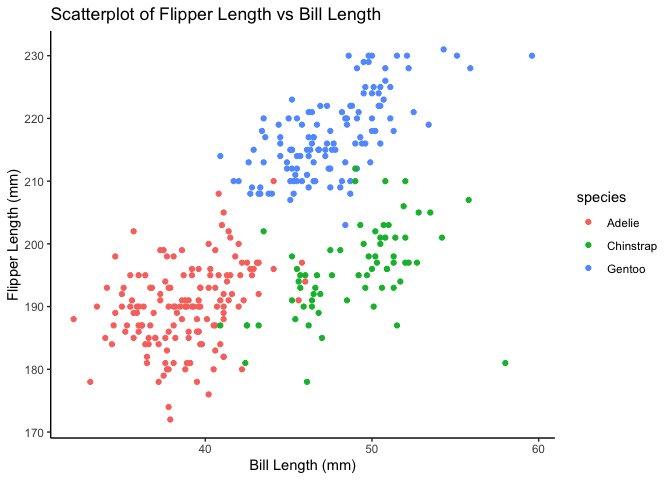

P8105_hw1_yx2954
================

# Problem 1

## Part 1

``` r
data("penguins", package = "palmerpenguins")
```

**Description**:

- 1.  Important variables

  - The species of penguins includes: Adelie, Gentoo, Chinstrap
  - The islands of oringin includes: Torgersen, Biscoe, Dream
  - The range of their bill length in mm are \[32.1, 59.6\]
  - The range of their bill depth in mm are \[13.1, 21.5\]
  - The range of their flipper length in mm are \[172, 231\]
  - The range of their body mass in g are \[2700, 6300\]
  - All data are from year of 2007, 2008, 2009

- 2.  Size of dataset

  - This dataset includes 344 rows, and 8 columns

- 3.  Mean flipper length

  - The mean flipper length is 200.9152047

## Part 2

``` r
scatterplot = ggplot(penguins, aes(x = bill_length_mm, y = flipper_length_mm, color = species)) +
  geom_point(na.rm = TRUE) +
  labs(
    title = "Scatterplot of Flipper Length vs Bill Length",
    x = "Bill Length (mm)",
    y = "Flipper Length (mm)"
  ) +
  theme_classic()

ggsave(filename = "scatterplot_flipper_vs_bill.png", plot = scatterplot, width = 10, height = 10, dpi = 300)

print(scatterplot)
```

<!-- -->

# Problem 2

Start with generate random vectors and combine them into a data frame

``` r
set.seed(123)

# Set random vectors
random_sample = rnorm(10)
logical_vector = random_sample > 0
char_vector = sample(c("我", "爱", "你", "中", "国"), size = 10, replace = TRUE)
factor_vector = factor(sample(c("Level1", "Level2", "Level3"), size = 10, replace = TRUE))

# Create a data frame with vectors
df = data.frame(
  random_sample = random_sample,
  logical_vector = logical_vector,
  char_vector = char_vector,
  factor_vector = factor_vector
)

df
```

    ##    random_sample logical_vector char_vector factor_vector
    ## 1    -0.56047565          FALSE          我        Level2
    ## 2    -0.23017749          FALSE          中        Level1
    ## 3     1.55870831           TRUE          我        Level3
    ## 4     0.07050839           TRUE          我        Level3
    ## 5     0.12928774           TRUE          国        Level1
    ## 6     1.71506499           TRUE          你        Level3
    ## 7     0.46091621           TRUE          爱        Level2
    ## 8    -1.26506123          FALSE          爱        Level1
    ## 9    -0.68685285          FALSE          我        Level3
    ## 10   -0.44566197          FALSE          你        Level1

Then get the mean of these random vectors with ‘pull()’ function.

``` r
mean(pull(df, random_sample))
```

    ## [1] 0.07462564

``` r
mean(pull(df, logical_vector))
```

    ## [1] 0.5

``` r
mean(pull(df, char_vector))
```

    ## Warning in mean.default(pull(df, char_vector)): argument is not numeric or
    ## logical: returning NA

    ## [1] NA

``` r
mean(pull(df, factor_vector))
```

    ## Warning in mean.default(pull(df, factor_vector)): argument is not numeric or
    ## logical: returning NA

    ## [1] NA

Of 4 random vectors, we can get the mean of random_sample and
logical_vector, we cannot get the mean of character_vector and
factor_vector. Should convert them into a different type.

``` r
as.numeric(pull(df, logical_vector))
```

    ##  [1] 0 0 1 1 1 1 1 0 0 0

``` r
as.numeric(pull(df, char_vector))
```

    ## Warning: NAs introduced by coercion

    ##  [1] NA NA NA NA NA NA NA NA NA NA

``` r
as.numeric(pull(df, factor_vector))
```

    ##  [1] 2 1 3 3 1 3 2 1 3 1

The ‘True’ and ‘False’ value in logical_vector is automatically
converted to 1 and 0 when calculating the mean, allowing the
calculation; the value in char_vector are still returning N/A,
indicating that char_vector cannot be converted into numerber; the value
in factor_vector are converted to numeric value, allowing the
calculation of mean.
